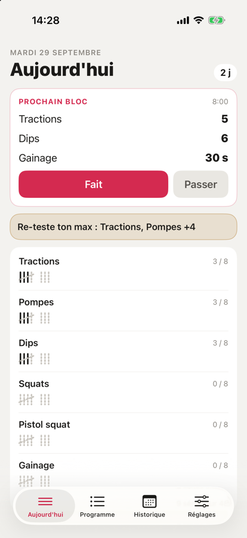
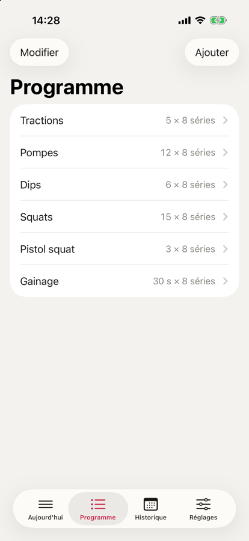
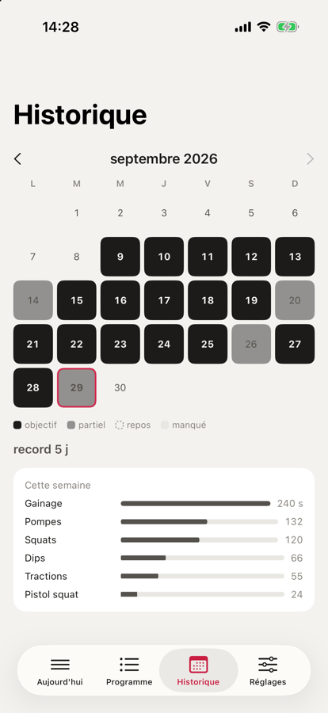
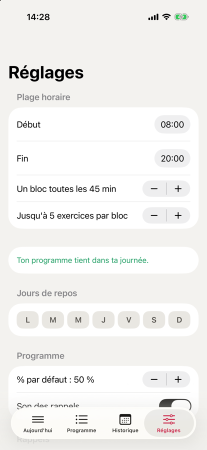

# GrooveCore

Application iOS pour suivre un programme *grease the groove* : beaucoup de petites séries, loin de l'échec, réparties sur toute la journée. Gratuite, sans compte, sans publicité, toutes les données restent sur le téléphone.

<p>
  
  
  
  
</p>

## Ce que fait l'app

- On teste son max sur chaque exercice. L'app en déduit les répétitions de travail (50 % par défaut, modifiable à la main) et propose un nouveau test à intervalle régulier.
- Les rappels tombent sur une plage horaire choisie, jamais les jours de repos. Chaque rappel regroupe plusieurs exercices dans un bloc, pour tenir une dizaine d'exercices actifs sans recevoir une notification toutes les dix minutes.
- On note un bloc directement depuis la notification avec « Fait » ou « Passer », sans ouvrir l'app.
- Chaque série est un bâton de comptage. L'historique montre les journées complètes, partielles, manquées et les jours de repos.
- Interface en français et en anglais.

## Stack

- Swift, SwiftUI, SwiftData, Swift Charts
- UserNotifications (actions sur la notification) et BackgroundTasks
- iOS 18 minimum, aucune dépendance tierce
- Projet Xcode généré par XcodeGen (`project.yml`)

## Organisation du code

- `GrooveKit/` : un package Swift qui ne dépend que de Foundation. Il contient toutes les règles : jours en heure locale, créneaux de rappel, calcul des répétitions, séries de jours, planificateur de blocs, fenêtre des 60 notifications que iOS autorise, contenu des notifications. Tout y est testé avec Swift Testing.
- `App/` : l'application. Persistance SwiftData (`Data/`), notifications (`Notifications/`), écrans (`Views/`).
- `AppTests/` : tests XCTest de la couche de données et des notifications, dont un test qui force deux reprogrammations concurrentes pour vérifier qu'elles s'exécutent l'une après l'autre.
- `scripts/` : génération des textes FR/EN depuis `strings.tsv`, contrôle que chaque texte est traduit, icône, captures d'écran.
- `docs/design/` : la spec de conception et la charte graphique.

Le planificateur répartit les séries restantes de chaque exercice sur les créneaux de la journée, décale les exercices entre eux pour qu'ils ne tombent pas tous au même moment, limite la taille des blocs et signale les séries qui ne tiennent pas dans la journée.

## Lancer le projet

```bash
brew install xcodegen
xcodegen generate
open GrooveCore.xcodeproj
```

Tests :

```bash
cd GrooveKit && swift test
xcodebuild test -project GrooveCore.xcodeproj -scheme GrooveCore \
  -destination 'platform=iOS Simulator,name=iPhone 17'
python3 scripts/check-l10n.py
```

En Debug, l'argument de lancement `-demo` remplit l'app avec une vingtaine de jours de données d'exemple.

## Licence

Code source consultable, tous droits réservés. Voir [LICENSE](LICENSE).
